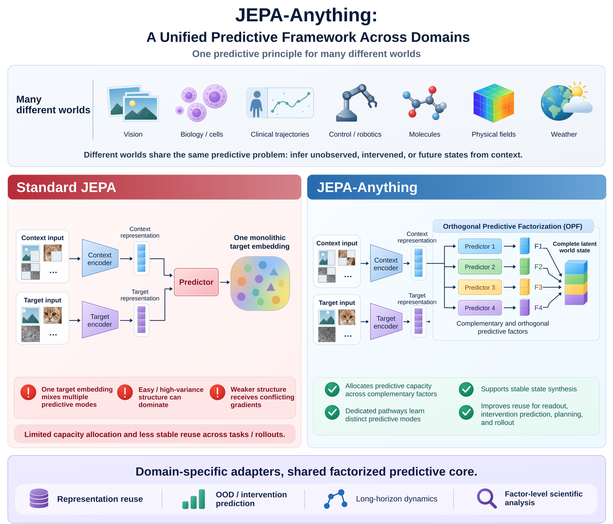
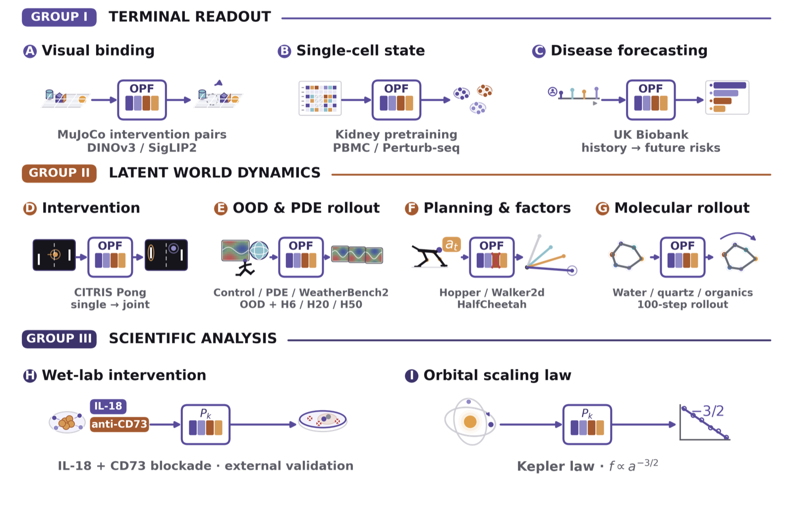

[English](README.md) · [快速开始](#快速开始) · [核心库](jepa-anything-core/README.md) · [示例任务](recipes/synthetic-linear-dynamics/README.md)

[论文](https://arxiv.org/abs/2609.20800) · [PDF](https://arxiv.org/pdf/2609.20800) · [引用](#引用)

<p align="center">
  
</p>

## 方法概览

**JEPA-Anything 是面向不同领域的预测建模框架。** 它建立在联合嵌入预测架构（JEPA）之上，通过**正交预测因子分解（Orthogonal Predictive Factorization，OPF）**，沿专门的预测路径学习互补因子，再重组成潜在状态，用于下游读出、干预预测、规划和多步连续预测。

各领域保留自身的观测形式、上下文—目标构造和编码器。共享的是预测原则与接口，不要求所有领域使用同一个编码器或同一组权重。

## 核心优势

| 原则 | 实现方式 | 对应用途 |
|---|---|---|
| 跨领域的共同原则 | 领域输入接入因子化预测核心 | 保留领域结构并复用建模方法 |
| 互补预测路径 | 因子分别预测并共同合成状态 | 表示复用、干预与分布外预测 |
| 完整状态的持续使用 | 重组预测因子 | 下游读出、规划与长时域预测 |
| 因子层面的分析 | 在领域实验中检验预测模式 | 结合证据解释生物干预与物理规律 |

## 项目导航

本仓库提供通用核心代码、任务设计工具和可执行的结构示例，可作为接入新领域的起点。

| 模块 | 用途 | 文档 |
|---|---|---|
| 核心库 | 因子投影、目标函数、基线和诊断 | [核心库指南](jepa-anything-core/README.md) |
| 任务设计 | 校验任务约定并生成代码骨架 | [设计契约](jepa-anything-skill/references/config-contract.md) |
| 示例任务 | 在可控系统中检查数据和接口 | [合成线性动力学](recipes/synthetic-linear-dynamics/README.md) |
| 架构 | 连接适配器、预测核心与下游用途 | [架构说明](docs/architecture.md) |
| 模型元数据 | 记录来源并检查完整性 | [清单指南](checkpoints/README.md) |

## 快速开始

<p align="center">
  <b>⚙️ 安装</b>&nbsp;&nbsp;•&nbsp;&nbsp;<b>🧪 运行</b>&nbsp;&nbsp;•&nbsp;&nbsp;<b>🧩 设计</b>
</p>

以下命令适用于 Linux/macOS shell。使用具有仓库访问权限的 GitHub 账号克隆后，在仓库根目录运行后续命令。需要 Python 3.10 或更新版本；核心库依赖 PyTorch，设计工具和结构示例仅使用 Python 标准库。

### 1. ⚙️ 获取代码并安装核心库

```bash
git clone https://github.com/Gen-Verse/JEPA-Anything.git
cd JEPA-Anything
python3 -m venv .venv
source .venv/bin/activate
python3 -m pip install -e './jepa-anything-core[dev]'
```

### 2. 🧪 运行结构示例

```bash
python3 recipes/synthetic-linear-dynamics/run_recipe.py --quiet
```

该命令检查数据与接口一致性，不训练模型，也不输出 benchmark 成绩。

### 3. 🧩 校验设计并生成代码骨架

```bash
python3 jepa-anything-skill/scripts/validate_design.py \
  recipes/synthetic-linear-dynamics/design.expected.json \
  --pretty --output work/quickstart/validation-report.json

python3 jepa-anything-skill/scripts/generate_scaffold.py \
  recipes/synthetic-linear-dynamics/design.expected.json \
  --output-dir work/quickstart/generated-task --config-format json

python3 -m unittest discover \
  -s work/quickstart/generated-task/tests -p 'test_*.py' -v
```

生成目录必须为空或尚不存在。再次运行时，请更换输出目录并同步调整测试路径。报告记录校验结果；代码骨架包含配置、接口和契约测试。

<details>
<summary><b>从观测到预测因子</b></summary>

编码器将观测映射为潜在状态，因子投影将预测坐标组织成组。预测器在给定上下文或动作的条件下建模变化，下游任务通过预测、连续推演或分析使用这些状态。

核心库提供公共操作，各领域提供观测适配器和评估流程。因子的物理或生物含义需要实验验证，不能由编号直接确定。

</details>

<details>
<summary><b>从任务描述到实现</b></summary>

明确可用观测、预测目标和下游用途，再用确定性校验器检查任务约定。生成的骨架提供适配器、模型、诊断和评估接口，具体领域实现负责补全这些接口。

</details>

## 场景图谱

<p align="center">
  
</p>

图谱展示三类研究场景：视觉、单细胞和临床场景的终端读出；干预、分布外预测、规划与分子轨迹等潜在世界动力学；以及将因子与湿实验、物理规律联系起来的科学分析。

## 仓库范围

两张图介绍更广泛的研究场景。本仓库包含通用核心、任务设计工具和合成结构示例，不包含图谱对应的领域数据集或训练权重。[模型清单](checkpoints/manifest.json)记录的是未经训练、不主张性能结果的示例。图中的定量和实验结论需要对应研究证据支持；结构检查不会复现这些结果。

## 开发检查

安装上述开发依赖后运行：

```bash
make check
```

该命令执行 JSON 校验、Python 编译、核心库与任务设计测试、设计校验、结构示例和清单检查。单项命令见 `make help`。

## 引用

如果本项目对你的研究有帮助，请引用我们的论文：

```bibtex
@article{cui2026jepaanything,
  title={JEPA-Anything: Learning Predictive Models across Different Worlds},
  author={Cui, Taoyong and Wang, Zhongyao and Xu, Xinyue and Liu, Weiyang and Yu, Zhaochen and Zhang, Yuying and Gao, Qiang and Yang, Mengyue and Ouyang, Wanli and Heng, Pheng Ann and Wu, Yingcheng and Yin, Zhenfei and Yang, Ling},
  journal={arXiv preprint arXiv:2609.20800},
  year={2026}
}
```

## 许可证

见 [LICENSE](LICENSE) 与[核心库许可证](jepa-anything-core/LICENSE)。
